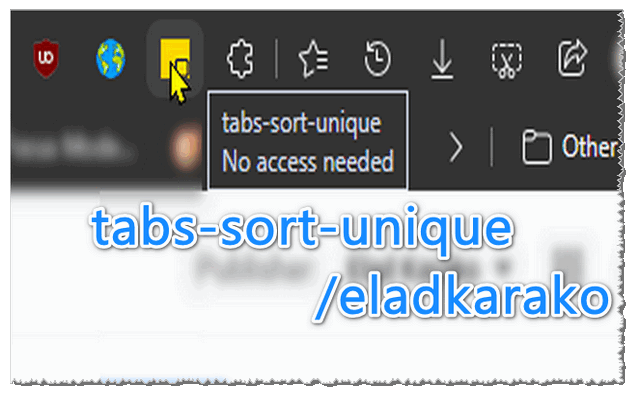

<h3> tabs-sort-unique</h3>

a web-extension for Chromium (edge, cromite) and Firefox based browsers.

- unify all tabs to a single window (new).
- remove duplicated tabs (based on tab's URL).
- sort all tabs (by their URLs).
- close all other windows and their tabs.

  

great when you restore crashed or previous session, 
undo windows and tabs, open a lot of items from history,  
and open a ton of links from a search-engine,  
with some overlap
(people do this often to no lose important items from history,  
since it is not always obvious which tab you've visited you've already closed).  

- web-extension uses `tabs` permission for managing windows and tabs.

- zero configuration, click icon to trigger unique and sort and move to new window.
- web-extension works offline, is not collecting any data, nor analytics.
- free and open-source (MIT).

feel free to open a bug or ask a question.

<a href="https://paypal.me/31adkarak0" target="_blank" rel="noopener noreferrer">
  
   
  
</a>

 
